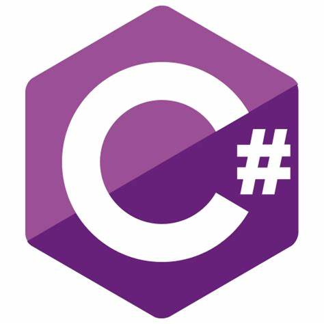

## Hi there 👋 Wisdom here

<!--
**wisdom-naz/wisdom-naz** is a ✨ _special_ ✨ repository because its `README.md` (this file) appears on your GitHub profile.

Here are some ideas to get you started: -->

- 🔭 I’m currently working on SureCrib a housing application for students
- 🌱 I’m currently learning the C# programming language, the .NET tech stack (including Microsoft SQL Server database, REST, gRPC and GraphQL architectures.)
- 👯 I’m looking to collaborate on software projects especially with backend technologies.
- 📫 How to reach me: You can reach at me at wisdom-s@outlook.com.
  
## What you should know about me

A Software Developer with at least than 2 years experience in the IT industry.
I am eager to work on software projects on the web, cloud, and mobile and also develop production systems for enterprises worldwide.
I'm also dedicated to enthusiastic and dynamic training as a means of nurturing a lifelong love of programming.
## I have some experience working with the following tech stacks.

  
  
  
  

-Microsoft tools and technologies

  
  
  

## Education and Certification

## UiPath Certified Advanced RPA Developer
Developing automation bots on the UiPath Platform

## UiPath Certified Professional Associate Developer
Developing automation bots on the UiPath Platform

## B.Eng in Electrical and Electronics Engineering
Landmark University
